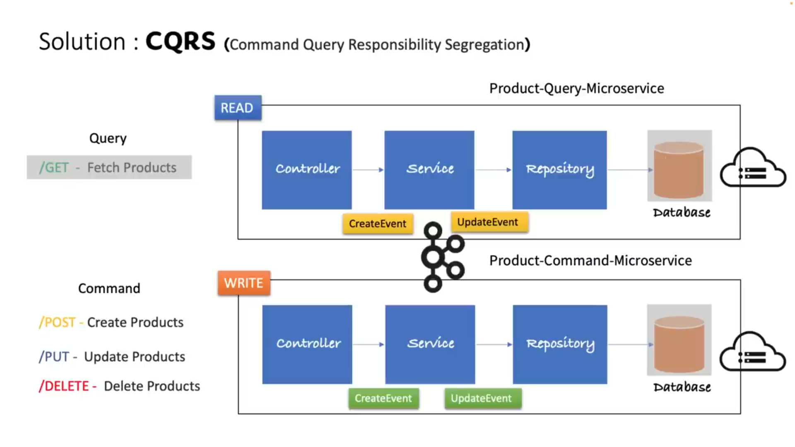

# CQRS Design Pattern with Apache Kafka & Spring Boot

This project demonstrates the implementation of the **CQRS (Command Query Responsibility Segregation)** design pattern in a **Products Microservice**. It leverages **Apache Kafka** for event-driven communication and **Spring Boot** for building a robust and scalable microservices.

---

## Table of Contents

- [Introduction](#introduction)
- [Features](#features)
- [Technologies Used](#technologies-used)
- [Architecture Overview](#architecture-overview)
- [Getting Started](#getting-started)
- [Usage](#usage)
- [Contributing](#contributing)
- [License](#license)

---

## Introduction

This repository aims to provide a practical implementation of the **CQRS** design pattern in a microservices architecture. The CQRS pattern separates the **write** operations (commands) from the **read** operations (queries), allowing for improved scalability, flexibility, and maintainability.

By integrating **Apache Kafka**, this project ensures reliable and asynchronous communication between different components of the system using event streams.

---

## Features

- **Command and Query Separation**: Ensures that write and read operations are handled independently.
- **Event-Driven Architecture**: Utilizes Apache Kafka (with KRaft) for event publishing and subscribing.
- **Microservice Design**: The application is structured as separate product command and query microservices.
- **Scalable and Resilient**: Designed to handle a large number of concurrent requests with ease.
- **Spring Boot Integration**: Simplifies development with pre-built components and configurations.

---

## Technologies Used

- **Java 21**: 100% of the codebase is written in Java.
- **Spring Boot**: For building the microservice.
- **Apache Kafka (with KRaft)**: For event-driven communication.
- **Spring Data JPA**: For database interactions.
- **MySQL** Separate databases for each microservice 
- **Maven**: For dependency management and build automation.

---

## Architecture Overview

The architecture is based on the CQRS pattern and consists of the following components:

1. **Command Side**:
    - Handles write operations (Create, Update, Delete).
    - Publishes events to Apache Kafka after executing commands.

2. **Query Side**:
    - Handles read operations.
    - Listens to Kafka events and updates the read model for efficient querying.

3. **Event Bus**:
    - Apache Kafka acts as the message bus for publishing and consuming events.
    - Ensures decoupled communication between the command and query sides.



---

## Getting Started

### Prerequisites

To run this project, you'll need:

- Java 17 or higher
- Apache Kafka installed and running
- Maven 3.8+ installed

### Installation

1. Clone the repository:
   ```bash
   git clone https://github.com/bruce-mig/cqrs.git
   cd cqrs
   ```

2. Install dependencies:
   ```bash
   mvn clean install
   ```

3. Configure Apache Kafka:
    - Run the following command `docker compose up -d`
    - Ensure Kafka is running locally on port `9094`.
    - Update Kafka configurations in `application.yml` if necessary.

4. Run the application:
   ```bash
   cd product-command-service
   mvn spring-boot:run
   ----
   cd product-query-service
   mvn spring-boot:run
   ```

---

## Usage

1. **Create a Product**:
    - In Command service, Send a POST request to `/api/commands/products` with product details.
      - Example:
        ```json
        {
           "name": "Book",
           "description": "Gödel, Escher, Bach: an Eternal Golden Braid",
           "price": 150
        }
        ```

2. **Query Products**:
    - In query service, Send a GET request to `/api/v1/products` to fetch all products.

3. **Update/Delete Products**:
    - Use respective endpoints under `/api/v1/products` for update and delete operations.

4. **Monitor Kafka Events**:
    - Use Kafka tools to monitor the `product-event-topic` topic for published events.

---

## Contributing

Contributions are welcome! If you'd like to contribute, please follow these steps:

1. Fork the repository.
2. Create a new feature branch:
   ```bash
   git checkout -b feature-name
   ```
3. Commit your changes:
   ```bash
   git commit -m "Description of changes"
   ```
4. Push to your branch:
   ```bash
   git push origin feature-name
   ```
5. Open a Pull Request.

---

## License

This project is licensed under the MIT License. See the [LICENSE](LICENSE) file for details.

---

Happy coding! If you have any questions or suggestions, feel free to open an issue or reach out. 🚀


